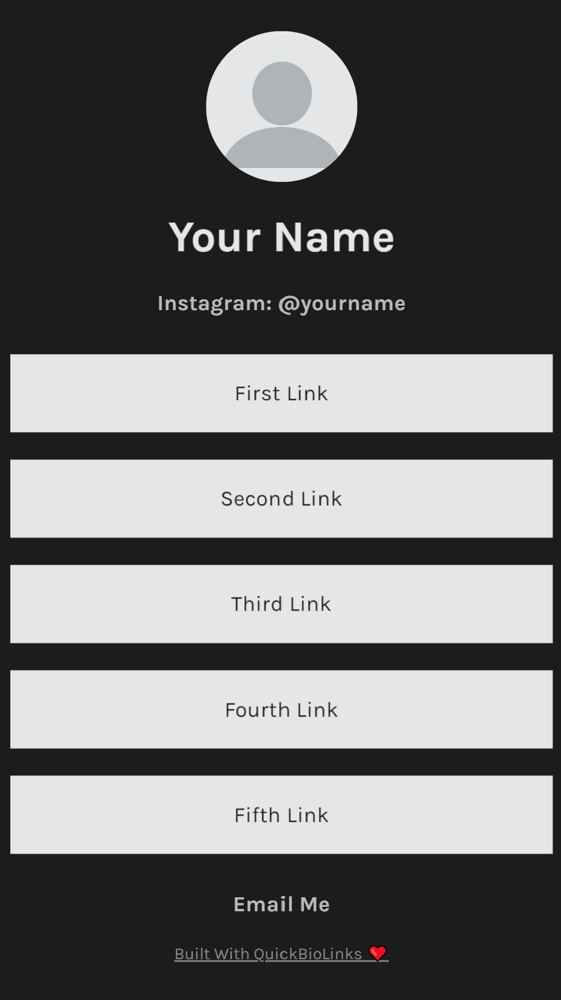

# QuickBioLinks

QuickBioLinks Is A Template For Creating Your Own Instagram bio Link

## Project

You can find the bio link templates in the [templates directory](https://github.com/mackenly/quickbiolinks/tree/master/templates).

**Clean Modern:**

[Clean Modern](templates/clean-modern/README.md)

**Simple Template:**

[Simple Template](templates/simple/index.html)

**Simple Dynamic Templates:**

[Simple Gravatar Dynamic Template](templates/simple-gravatar-dynamic/README.md)

[Simple CloudFlare Dynamic Template](templates/simple-cloudflare-dynamic/README.md)

**Glass Modern Template:**

[Glass Modern Template:](templates/glass-modern/readme.md)

## Hosting

Host your Quick Bio Link page using a free tier or low cost service by following our help [hosting guides](HOSTING.md).

Quick Bio Link pages are simple HTML, CSS, and JavaScript pages which means that they can be hosted nearly anywhere with free and low cost
options.

## Users

[Mackenly Jones - @mackenlyjones](https://links.mackenly.com/)

 _Using one of our templates? Add your name and link!_

## Contributing

Pull requests are welcome. For major changes, please open an issue first to discuss what you would like to change. Please see the
[contribution guide](https://github.com/mackenly/quickbiolinks/blob/master/CONTRIBUTING.md) first. Fast load speeds are a must. Shoot for a
95+ Page Speed Insights Score. Plus, dynamic content is always a benefit.

## License

[Apache License 2.0](https://github.com/mackenly/quickbiolinks/blob/master/LICENSE)
