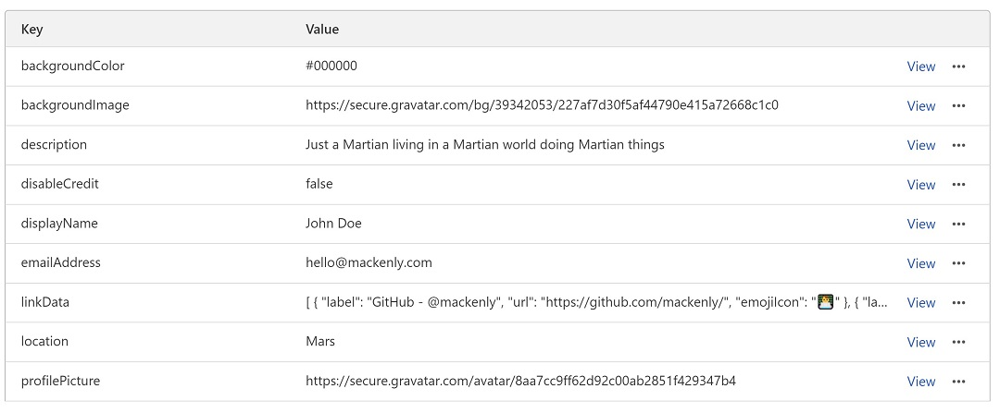

# Simple CloudFlare Dynamic
 This template is a version of the simple design that dynamically updates using CloudFlare Key Value stores (CloudFlare KV).

 [Here's a Live Example](https://quickbiolinks-simple-cloudflare-dynamic.mackenly.workers.dev/)

 It all needs to be delivered with a worker and integrated with KV pairs. No JS will need to be delivered to the client since all of the processing is handled server side on runtime. The client is delivered a clean (and well organized) HTML file with all the data hydrated into the content.

 The best part is that it's crazy fast, doesn't rely on a 3rd party for data, and likely within CloudFlare's free limits.


## Customization
All the data in this template is loaded in from Key Value pairs from a service called CloudFlare KV. This service allows you to create namespaces to hold your KV pairs. You'll need to use the same key names in order for the template to work without further customization.



**Keys and Values:**

***backgroundColor***

Here you can specify a background color for your page. This color is also used as the theme color which may appear in some browsers. The key name should be "backgroundColor" and the value should be a color code such as #000000 (which is black.

***backgroundImage***

Here your specify a background image to be used on your site. This should be a publicly accessible URL to the image file. The key name should be "backgroundImage" and the key should be a URL pointed to an image.

***description***

The description is the short bio that displays below your name. Note, you can add any HTML here that you want, so if you want to add a link from your bio text or do some sort of special formatting this is the place to do it. The key name should be "description" and the value can be any text you want.

***disableCredit***

This allows you to hide the small credit link that appears on the bottom of the page. To hide the link simply set the value to "true". The key name should be "disableCredit" and the value can be "true" or "false".

***displayName***

Your display name is the name you want to appear on your link page. This can be your personal name, your username, or your business name. It's up to you! The key name should be "displayName" and the value text should be your preferred display name.

***emailAddress***

This field allows you to add an email link to the bottom of your links. To disable the link simply set the value to "hide" and it won't be shown. Note, that if you do choose to show your email address it will be publicly accessible. The key name should be "emailAddress" and the value should either be your email address or "hide".

***linkData***
This is the place where you add links. The syntax can be a bit difficult when freetyping it so feel free to copy and paste the following as a template. The key name should be "linkData" and the value should be JSON formatted like the following:

```json
    [
        {
            "label": "GitHub - @mackenly",
            "url": "https://github.com/mackenly/",
            "emojiIcon": "👨‍💻"
        },
        {      
            "label": "Schedule a 15-minute Meeting",
            "url": "https://calendly.com",
                "emojiIcon": "📆"
        }
    ]
```

Note: You can have as many links as you'd like. Just copy and paste the blocks.

***location***

The location field allow you to add a location. It doesn't have to be accurate and you can also use it for your job title or slogan. The key name should be "location" and the value can be anything you want to appear in the sub heading.

***profileImage***

Here your specify a profile image to be used on your site. This should be a publicly accessible URL to the image file. The key name should be "profileImage" and the key should be a URL pointed to an image.


## Hosting
- To host this webpage your simply need to create a CloudFlare Worker and paste in the contents of [worker.js](worker.js). 
- Next, go to the KV tab and create a new KV namespace. It can be called anything you'd like. Then create keys and values matching the options discussed in the Customization section of this page. 
- After your keys and values are created go back to your Worker, navigate to the Settings tab, and bind your KV namespace to your worker. That will give your worker access to your namespace.
- Now your page should be accessible and working as expected from your workers.dev subdomain. But if you're like me you likely want to attach it to your own domain. To do that jump over to your domain's dashboard in CloudFlare. Once you're there select the Workers tab. On that page there should be a button labled Add Route. Select it and follow the steps to point your route to your Worker.
- Great! You did it. 🎉 